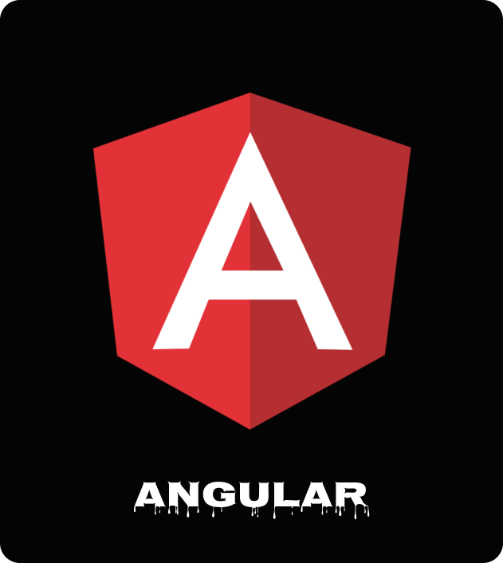

## Bio
Hi All! My Name is Taha. I'm 15y.o and I live in [Iran](https://en.wikipedia.org/wiki/Iran). I spend my whole day, practically every day with coding;
I build websites that be useful and speedy. I do it well.
I’m curious, and I enjoy work that challenges me to learn something new and stretch in a different direction.
I do my best to stay on top of changes in the state of the **Art**. so that I can meet challenges with tools well suited to the job at hand.

## Tchnologies i use
 

## Social Media  

## Screenfetch
openSUSE Linux, DE: Xfce

## My Roadmap for this year
* Taking LPIC-1 Certification
* Taking C# Certification [just for fun :|]
* Learning Angular
* Learning Crystal-Lang
* Teaching Ruby at instagram
