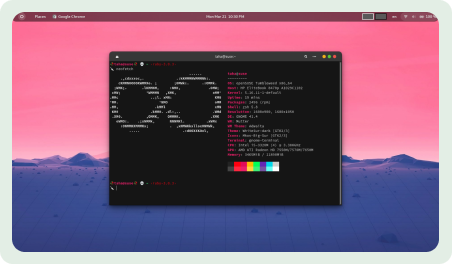
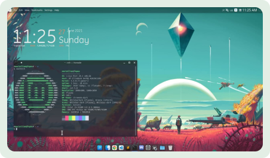
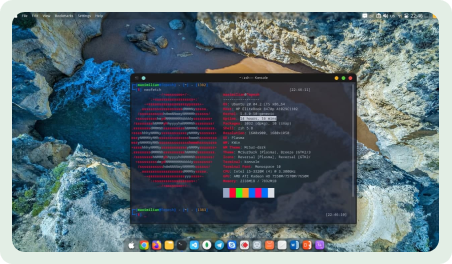

### Hi there

I'm **Taha Dostifam**, a 17-year-old software engineer based in Iran.
While I might not be old enough to drive, I've been coding for almost 8 years now! My passion for programming started early, and it's been an incredible journey of building, creating, and solving problems with code.

When I'm not coding, you might find me lost in the world of music, or tinkering with Linux desktops, customizing them to my perfect workflow. But my technical interests take a more serious turn when it comes to software architecture and networks. I'm a firm believer in **clean code** practices, taking inspiration from the works of Uncle Bob (Robert C. Martin).

Currently, I'm pouring my energy into building a chat-application called [**Kavka**](https://github.com/kavkaco). It's an exciting project that allows me to combine my love for coding with the challenge of creating a user-friendly and efficient communication tool.

## Tech Stack

## Customized Desktops
Click on each image to get original image.

    
    
    

        

## Contact with me on
- [X (Twitter🤦)](https://twitter.com/taha__dev)
- [Instagram](https://instagram.com/taha_dostifam)
- [Telegram](https://t.me/tahadostifam)
