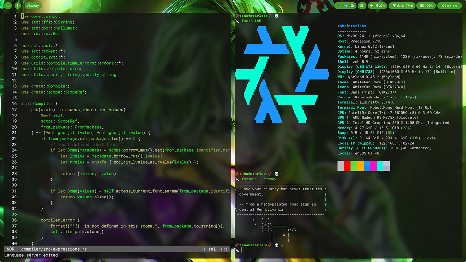

### Hi there

I’m Taha, an 18-year-old software engineer with a passion for back-end development and crafting efficient, scalable software solutions. I thrive on solving complex problems and am deeply fascinated by software architecture, compiler design, and programming language implementation. These areas allow me to explore the intricacies of how systems and languages are built, and I’m always eager to dive deeper into the theoretical and practical aspects of software engineering.

When I’m not immersed in coding, you’ll likely find me exploring the vast world of music or customizing my Linux environment, particularly tinkering with window managers to create the perfect workflow. I’m a strong advocate for Free and Open Source Software (FOSS) and actively contribute to open-source projects, believing in the power of collaboration and community-driven innovation.

Driven by curiosity and a love for learning, I’m constantly seeking new challenges and opportunities to grow as a developer and contribute to the ever-evolving tech landscape.

Let’s connect and build something amazing together! 🤌🏿❤️

## Tech Stack

## My Workspace

