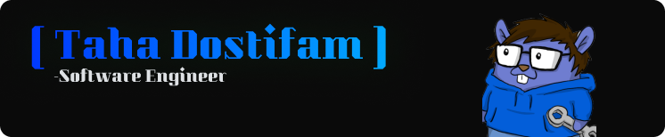
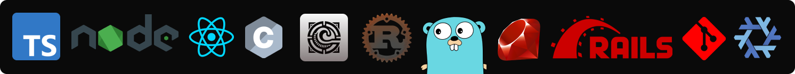
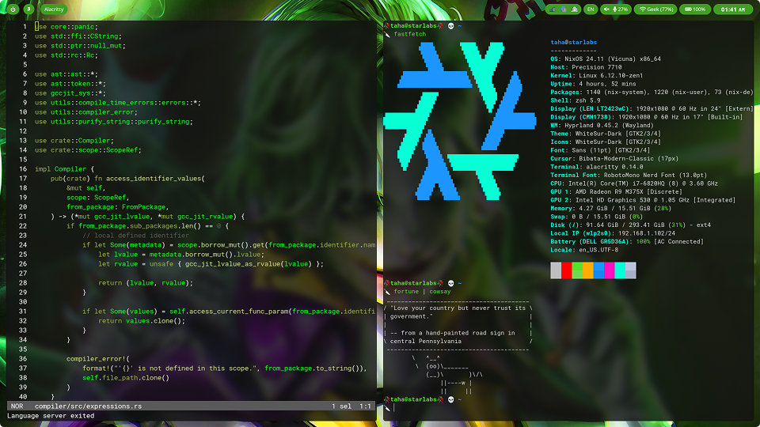

### Hi there

Hi, I’m Taha. A 19-year-old software engineer focused on back-end systems, compilers, and low-level software design. I care deeply about performance, clarity, and correctness, and I enjoy building systems that stay simple even under pressure.

### 🚀 Projects & Work

- [**Cyrus: Systems Programming Language**](https://cyrus-lang.ir/en) (Creator): A systems programming language designed for simplicity, high performance, and low cognitive overhead, reducing long-term maintenance costs while keeping full control in the hands of the developer.

- [**Geek Engineers Programming Community**](https://geekengineers.netlify.app) (Founder): A community for engineers who take software seriously. We share extremist-level software engineering guidance through our website and Telegram channel, focusing on open source, deep technical understanding, and recreational programming.

### 🧠 Interests

My main interests include compiler design, programming language implementation, software architecture, and system-level performance engineering. I'm a strong believer in Free and Open Source Software and actively contribute to projects that value transparency and long-term maintainability.

I'm driven by curiosity, allergic to unnecessary abstraction, and always looking to build systems that age well.

## Tech Stack

## My Workspace

