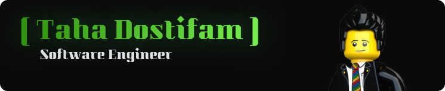

### Hi there

Hi, I’m Taha. An 18-year-old software engineer focused on back-end systems, compilers, and low-level software design. I care deeply about performance, clarity, and correctness, and I enjoy building systems that stay simple even under pressure.

### 🚀 Projects & Work

- **Cyrus: Systems Programming Language** (Creator): A mid-level, imperative systems programming language designed for developers who want modern power without modern complexity.
Cyrus emphasizes explicit control, a lightweight memory model, zero runtime dependency, and a clean syntax. If you’re comfortable with C or Go, Cyrus will feel familiar — just more disciplined and elegant.

- **Geek Engineers Programming Community** (Founder): A community for engineers who take software seriously. We share extremist-level software engineering guidance through our website and Telegram channel, focusing on open source, deep technical understanding, and recreational programming.

- **Kavka Open Source Messenger** (Creator): A secure, privacy-focused messaging platform written in Go. Built using Clean Architecture principles, Kavka provides a scalable and maintainable foundation for private chat systems and secure collaboration tools.

### 🧠 Interests

My main interests include compiler design, programming language implementation, software architecture, and system-level performance engineering. I'm a strong believer in Free and Open Source Software and actively contribute to projects that value transparency and long-term maintainability.

I'm driven by curiosity, allergic to unnecessary abstraction, and always looking to build systems that age well.

## Tech Stack

## My Workspace

